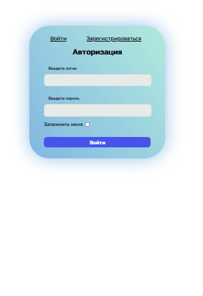
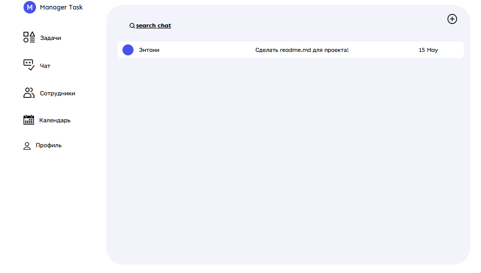
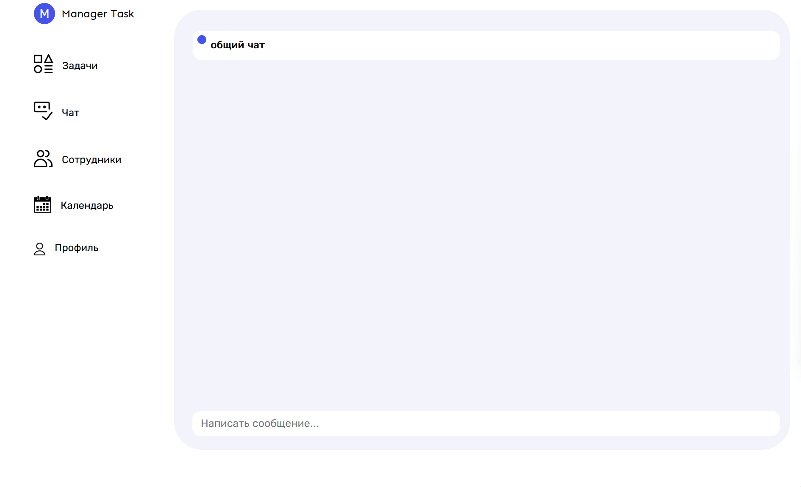

# Task Manager 📝

Простое веб-приложения, для распределения задач между сотрудниками, с системой аккаунтов.  
Создано с помощью Flask.

## Installing ##

    git clone https://github.com/ex2mple/TaskManager.git
    pip install -r requirements.txt

## Preview ## 

**Форма регистрации и входа**  

**Главная страница.** Здесь находятся задания для сотрудников  

**Общий чат.** Реализован на flask-socketIo  

## Contributors 🫱🏽‍🫲🏾

[@ex2mple](https://github.com/ex2mple)  
[@AlexonV](https://github.com/AlexonV)

